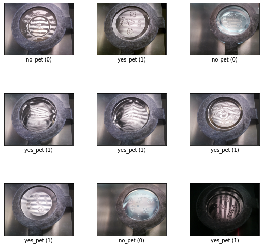
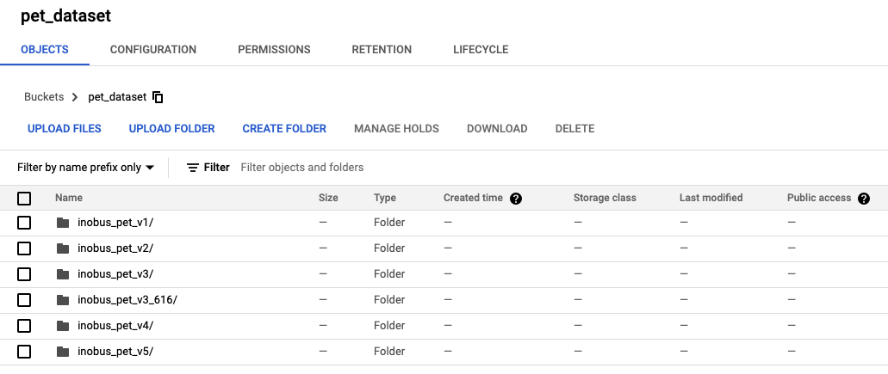

## [데모 영상](https://www.youtube.com/watch?v=LlmhgZJv-nE&t=50s)


## Deep Learning 환경설정
Python 3.8 Virtual Environments 설정
`pip install -r requirements.txt` 실행

```shell
# Example
python3 -m venv <venv_name>
source <venv_path>/bin/activate
python -m pip install -–upgrade pip
pip install -r requirements.txt
```

## 데이터 예제


## 데이터 받기
(데이터는 내부에서만 공유합니다.)

### 직접 다운로드 받기
Google Storage에서 직접 다운로드 (주소: gs://pet_dataset/inobus_pet_v5)


### Colab에서 tfds 툴 이용을 이용해서 다운받기
- 데이터 접근이 허용된 계정으로 로그인
  ```python
  # 로그인
  from google.colab import auth
  auth.authenticate_user()`
  ```
- tfds 툴로 데이터 다운로드
  ```python
  # tfds 데이터 다운로드 예제
  !pip install -q tfds-nightly
  import tensorflow_datasets as tfds
  ds, info = tfds.load('inobus_pet_v5', with_info=True, data_dir='gs://pet_dataset/inobus_pet_v5')
  ```
  
  
  
## 데이터 빌드 및 업로드
- `tfds new "dataset_name"` 명령으로 세로운 데이터셋을 만든다.
- 다음과 같이 데이터 디렉토리를 구성한다.

      pet_dataset
           |- train
           |   |- yes_pet
           |   |- no_pet
           |- test
               |- yes_pet
               |- no_pet
- `_PATH` 변수를 데이터셋 디렉토리의 루트로 지정
  - (예제: dataset/inobus_pet_v1)
- 데이터셋 폴더에서 `tfds build` 실행
  - 빌드 결과를 GCP Storage에 올리기 위해서는,
    - `export GCS_BUCKET="bucket address"` 명령으로 Bucket 환경변수 설정
    - (예제: `export GCS_BUCKET=gs://pet_dataset`)
    - `tfds build --data_dir=$GCS_BUCKET/dataset_name` 명령으로 빌드, 업로드
    - (예제: `tfds build --data_dir=$GCS_BUCKET/inobus_pet_v5`)
- "dataset/inobus_pet_v1/data_example.ipynb" 으로 데이터 사용예제 확인
